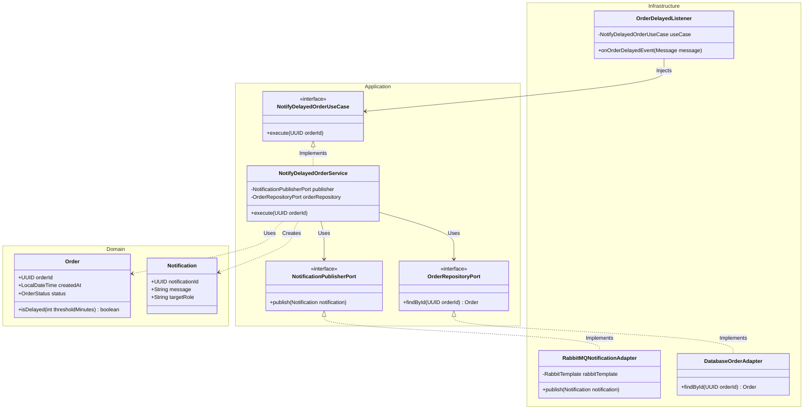
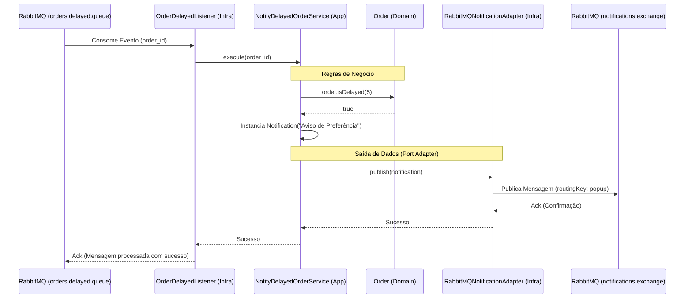
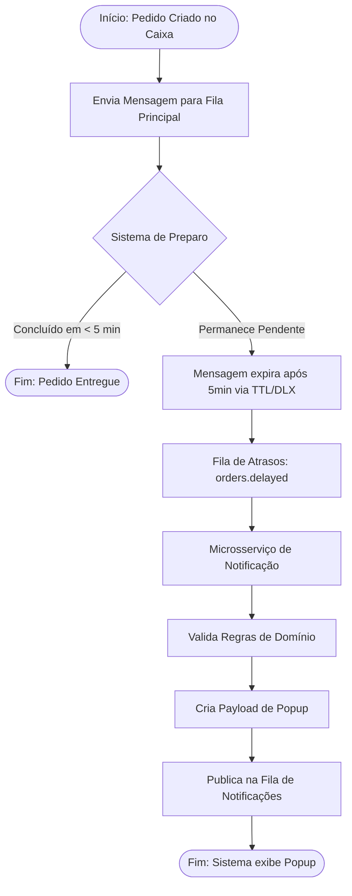

# Arquitetura do Microsserviço de Notificações - Kento Café

Este documento detalha o design arquitetural, o fluxo de comunicação e as regras de negócio do serviço de notificações utilizando Clean Architecture.

## 1. Diagrama de Classes (Estrutura Arquitetural)

## 2. Diagrama de Sequência (Fluxo de Execução)

## 3. Diagrama de Processo de Negócio (Fluxo Lógico)

